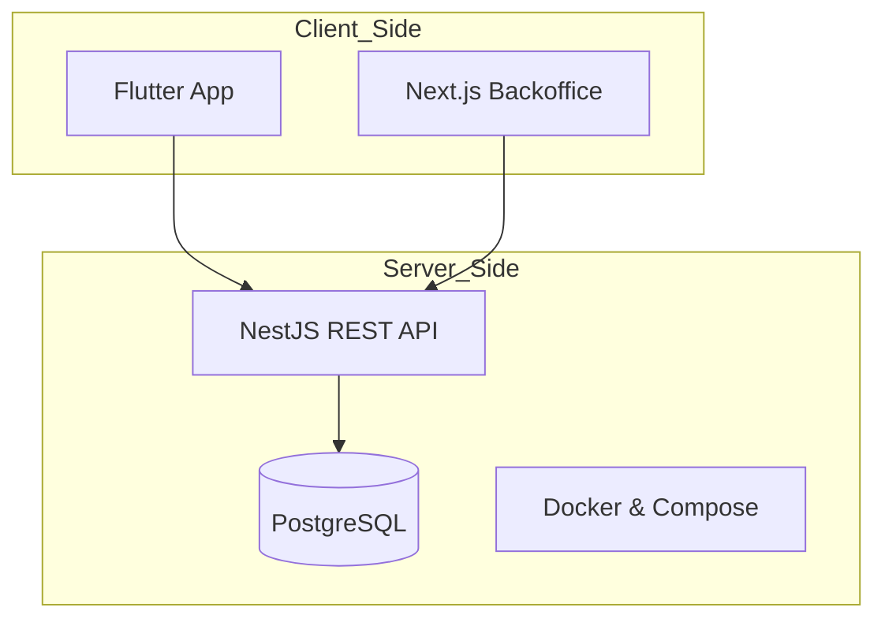
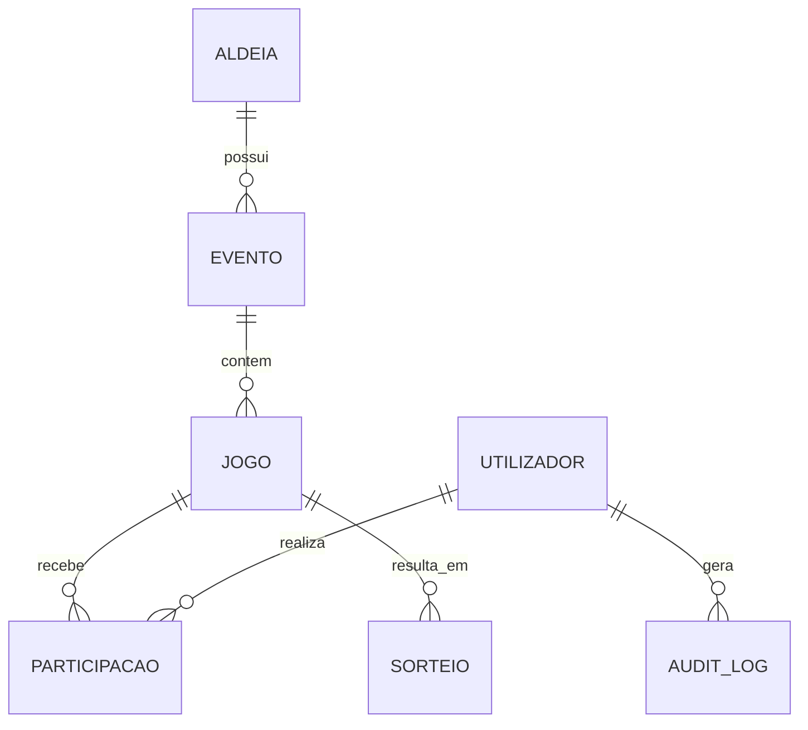
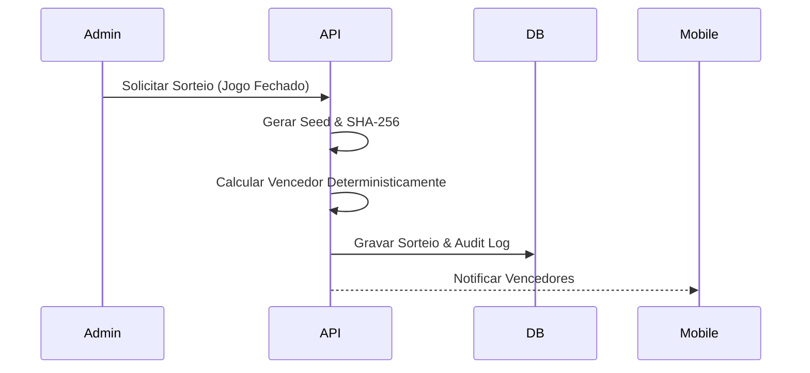

# 🐄 Jogos Tradicionais - Plataforma de Angariação de Fundos

## 📝 Descrição do Projeto
A plataforma **Jogos Tradicionais** é uma solução digital inovadora para a modernização das angariações de fundos em festas de aldeia, comissões de festas e associações. O sistema permite gerir e participar em jogos como o "Poio da Vaca" e "Rifas" de forma transparente, auditável e segura.

## 🚀 Funcionalidades Principais

### ✅ Implementadas
- **Multi-Tenant**: Suporte para múltiplas aldeias com isolamento total de dados.
- **Gestão Administrativa (Backoffice)**: CRUD completo de Aldeias, Eventos e Jogos.
- **Sistema de Sorteios Determinístico**: Resultados calculados via SHA-256 com seed auditável.
- **Participações Interativas**: Grelha dinâmica para Poio da Vaca e seletor para Rifas no Mobile.
- **Histórico e Auditoria**: Registo de todas as ações sensíveis e histórico de compras.
- **Exportação de Dados**: Listagens de participantes em formato CSV.
- **Segurança**: Autenticação JWT com RBAC (Super Admin, Aldeia Admin, User).

### ⏳ Em Planeamento / Pendentes
- **Pagamentos Reais**: Integração com Stripe e MBWay (atualmente simulado).
- **Streaming ao Vivo**: Transmissão WebRTC para sorteios.
- **Geolocalização**: Check-in baseado em GPS.
- **Novos Jogos**: Jogo do Galo, Leilão de Cabazes e Roleta.

## 🏗️ Arquitetura e Tecnologia

### Stack Técnica
- **Backend**: NestJS, TypeORM, PostgreSQL.
- **Frontend Admin**: Next.js 14, Tailwind CSS, Lucide React.
- **App Mobile**: Flutter 3.24.x, Provider State Management.
- **Infra**: Docker, GitHub Actions (CI/CD).

## 📊 Estrutura da Base de Dados (ERD Simplificado)

## ⚙️ Instalação e Execução

### Pré-requisitos
- Docker & Docker Compose
- Node.js 20+
- Flutter SDK 3.24+

### Backend
1. `cd backend`
2. `npm install`
3. `docker-compose up -d`
4. `npm run start:dev`

### Backoffice
1. `cd frontend/backoffice`
2. `npm install`
3. `npm run dev`

### Mobile
1. `cd frontend/mobile`
2. `flutter pub get`
3. `flutter run`

## 🛠️ Funcionamento Interno: Sorteio Auditável
O sorteio utiliza um processo determinístico para garantir transparência total:
1. Uma **Seed** é gerada (Timestamp + UUID).
2. É calculado o **Hash SHA-256** da Seed.
3. O resultado é calculado usando o módulo do Hash sobre o total de posições/bilhetes.
4. Todos os dados (Seed, Hash, Resultado) são públicos para verificação manual.

## ⚠️ Problemas Conhecidos e Melhorias
| Gravidade | Problema | Impacto | Recomendação |
| :--- | :--- | :--- | :--- |
| **Importante** | Falta de Rate Limiting | Vulnerável a ataques DoS/Brute Force | Implementar NestJS Throttler. |
| **Moderado** | Redundância em Participações | Pequeno risco de race condition | Usar Unique Constraints nativas apenas. |
| **Cosmético** | Métodos Depreciados | Flutter warnings no build | Atualizar withOpacity para withValues. |

## 🗺️ Roadmap Sugerido
- **Q1 2025**: Lançamento da v1.0 com pagamentos MBWay integrados.
- **Q2 2025**: Adição do módulo de Live Streaming e Notificações Push reais (FCM).
- **Q3 2025**: Expansão para novos jogos e modo offline para zonas com pouca rede.

---
Desenvolvido por **Jules (AI Engineer)**.
